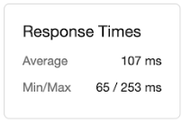

# CurveMetrics - Affordability Calculator Optimization

# Description
Legacy code base inherited from Cousco.us; repo contains a rehearsal re-factoring with Cassandra particularly with the affordability calculator. Project demands specified to focus primarily on scalability and loadtimes.
Goals following initial walkthrough of product:
- [x] Reduce DB Size demands
- [x] Cut response times
- [x] Refined calculator algorithms to reduce error rate
- [x] Implement use of CQL, phase out MySQL

<strike>Deadline: 02/18/2020</strike>


## Table of Contents
1. [Related](#Related)
1. [Requirements](#Requirements)
1. [Usage](#Usage)
1. [Development](#Development)
1. [Demo](#Demo)
1. [Results](#Results)
1. [API](#API)

## Related

  - https://github.com/Curve-Metrics/Carousel-Service-Optimization.git
  - https://github.com/Curve-Metrics/Photos-Optimization.git

## Requirements

- [Cassandra](https://cassandra.apache.org/download/)

- Node 6.13.0+

- .CSV Management Application

## Usage

### Installing Dependencies
- From within the root directory:
```sh
npm i -g webpack
npm i
```
### Starting the server
- Start server * client using the follow commands:
```sh
npm run dev:start
npm run start
```
### Seeding the database
- If necessary, seed database using:
```sh
node old-max-space-size=8192 seed.js
```
> BE AWARE THE CURRENT SEED IS SET TO GENERATE 50,000,000 INSTANCES OF DATA AND MAKE TAKE UPWARDS OF 30 MINUTES

</br>

## Development
- Dependencies
> Axios, Cassandra-driver, CORs, CSV-Parser, Currency-formatter, DotENV, Faker, React/-DOM, Styled-Components
- Dev-Dependencies
> Babel, Enzyme, ESLint, FakerJS, Jest, LoaderIO, NewRelic, Webpack, ElastiCache-Driver

</br>

## Demo


</br>

## Results
Initial Stastics and response times: | .
----- | ------
 Page load - 3.95s </br> Response Times(avg) - 517ms  </br> Cluster Size - 11.94gb | 

Optimized Stastics and response times: | .
----- | ------
 **Page load - 2.71s** </br> **Response Times(avg) - 107ms**  </br> **Cluster Size - 210.34mb** | 

</br>

## API

### Select all listings

-GET `/api/listings/`

**Success Status Code:** `200`

**Returns:** Expects JSON with the following keys.

```json
    {
      group_id: INT
      home_id: INT
      cost: INT
      address: TEXT
      createdAt: Date
    }

```

### Select listings matching listing:id

-GET `/api/listings/:id`

**Success Status Code:** `200`


**Returns:** Expects JSON with the following keys.

```json
    {
      home_id: INT
      cost: INT
      address: INT
      tax_id: INT
      loan-Type: INT
      seller: INT
      createdAt: Date
    }

```

### Insert new listing

-POST `/api/listings`

**Path Parameters:**
- `id` - listing ID

**Request Body**
```json
{

  price: INT
  address: TEXT
  seller: INT
}
  ```

**Path responses:**
**Success Status Code:** `201`

**Response format:**
* Returns: JSON

```json
    {
      "message": "Successfully added a listing."
    }
```

```json
    {
      "message": "Failed to add a listing."
    }
```

### Update existing listing

-PATCH `/api/listing/:id`

**Path Parameters:**
- `id` - listing ID

**Request Body**
*
```json
 {
  price: INT
  address: TEXT
  seller: INT
  }
  ```

**Path responses:**
**Success Status Code:** `201`


**Response format:**
* Returns: JSON

```json
    {
      "message": "Successfully updated a listing."
    }
```

```json
    {
      "message": "Failed to update a listing."
    }
```

### Remove listing matching listing:id

-DELETE `/api/listing/:id`

**Path parameters:**
- `id` - Listing id

**Request Body**
*

   ```id``` listing id


### Path responses:
**Success Status Code:** `204`


### Response format:
* Returns: JSON

```json
    {
      "message": "Successfully deleted a listing."
    }
```

```json
    {
      "message": "Failed to deleted a listing."
    }
```
## Mortgages API

### Get all local tax rates
-GET `/api/taxRates/`

**Path Parameters:**
- `taxRates` - Tax rates

**Success Status Code:** `200`


**Returns:** Expects JSON with the following keys.

```json
{
  tax_id: INT
  county: STRING
  rate: INT%
}
```
### Get specified tax rate
-GET `/api/mortgages/:id`

**Path Parameters:**
- `id` - mortgages id

### Path responses:
**Success Status Code:** `201`


**Returns:** Expects JSON with the following keys.

```json
{
  mortgage_ID: STRING
  terms: STRING
  fees: INT
  rate: INT
  apr: INT
}
  ```

</br>

## __USER API__

### Add a user

- POST `/api/sellers`

**Success Status Code:** `201`


**Request Body**: Expects JSON with the following keys.

```json
{
  id: INT
  name: String
  email: String
  ip: String
}
```

### Get information regarding a specific User

-GET `/api/sellers/:id`

**Path Parameters:**
- `id` - user ID

**Success Status Code:** `200`


**Returns:** Expects JSON with the following keys.

```json
{
  id: INT
  name: String
  email: String
  password: String
  ip: String
}
```

### Update User Info by matching id

-PATCH `/api/sellers/:userId`

**Path Parameters:**
- `id` - user ID

**Request Body**
*
```json
{
  id: INT
  name: String
  email: String
  password: String
  ip: String
}
```

### Path responses:
**Success Status Code:** `201`


### Response format:
* Returns: JSON

```json
    {
      "message": "Successfully updated a user"
    }
```

```json
    {
      "message": "Failed to update a user."
    }
```

### Remove a user

-DELETE `/api/user/:id`

**Path Parameters:**
- `id` - user ID

**Request Body**

   ```id``` user ID


### Path responses:
**Success Status Code:** `204`


### Response format:
* Returns: JSON

```json
    {
      "message": "Successfully deleted a user from database."
    }
```

```json
    {
      "message": "Failed to deleted a user from database."
    }
```
